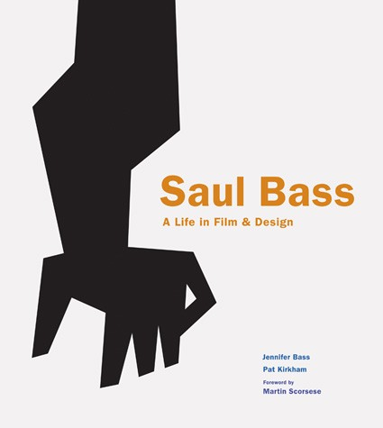

# Adolfo

Fichero para la Jaquería

Así escribo **texto en negrita**  
Y así escribo *texto en cursiva*  

## Título h2

### Título h3

Así incluimos una imagen:
descargar en la carpeta del proyecto

